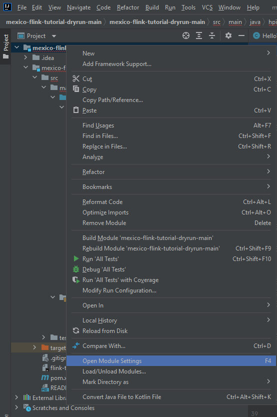
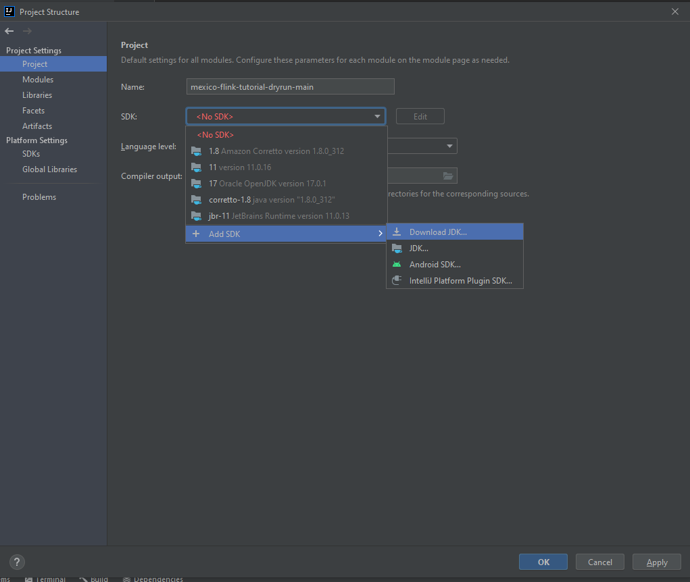

# Flink Tutorial


## Requirements

- IntelliJ

Ubuntu users can run the following commands to install IntelliJ.
```bash
sudo snap install intellij-idea-community --classic
```

macOS users can run the following commands to install IntelliJ.
```bash
brew install --cask intellij-idea-ce
```

Windows users can download and manually install IntelliJ with the following link.
[https://www.jetbrains.com/de-de/idea/download/#section=windows](https://www.jetbrains.com/de-de/idea/download/#section=windows)

## Tutorial

Clone the repository
```bash
git clone https://github.com/hpides/mexico-flink-tutorial.git
```
or download it manually and unzip the folder
[https://github.com/hpides/mexico-flink-tutorial.git ](https://github.com/hpides/mexico-flink-tutorial.git )

Start IntellJ and open the unzipped folder. Right click on the project in the sidebar. Select *Open Module Settings*.



Go to *Project* under *Project Settings* and add a new SDK. Select a Java 11 version as otherwise the tutorial may not
work, e.g. click on *Download JDK* and select *corretto-11* SDK von Amazon. Wait until the download is finished. Select the
*corretto-11* SDK and click on *Apply*.



